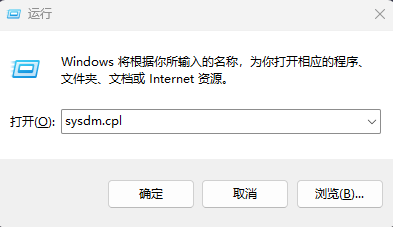
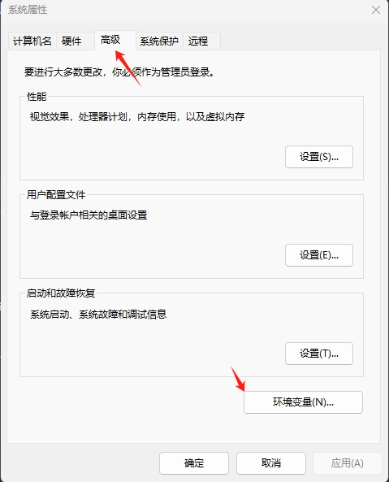
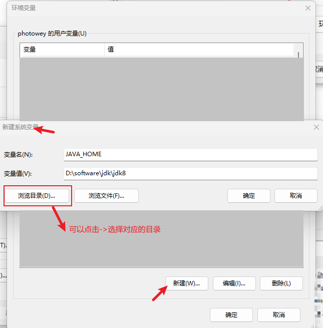
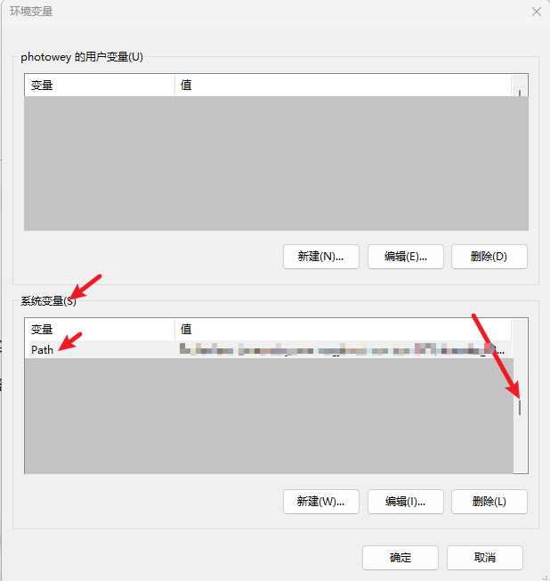
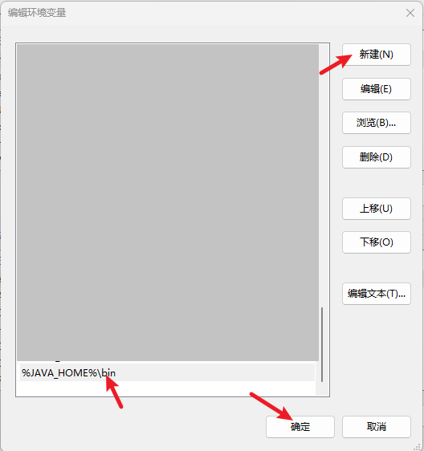
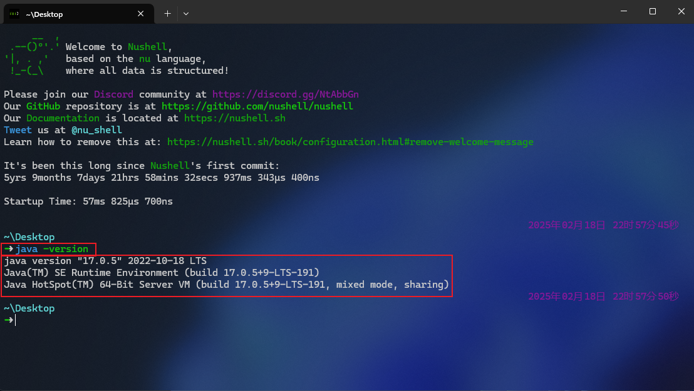
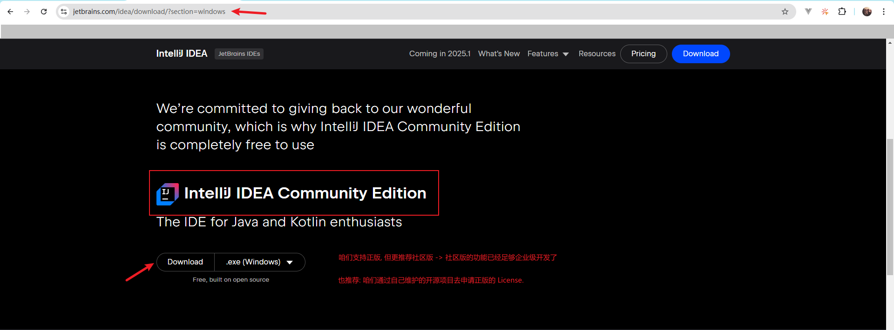
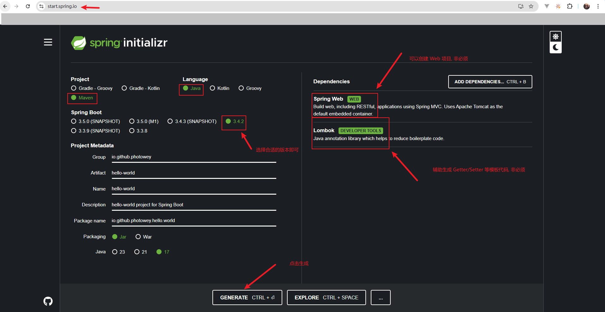

# `java-in-action`

A beginner-friendly Java project that provides code examples covering fundamental concepts,
core features, and common use cases of the Java programming language.
This project helps beginners quickly grasp Java through hands-on examples and detailed annotations.

一个适合初学者的 `Java` 项目，提供涵盖 `Java` 编程语言的基本概念、核心功能和常见用例的代码示例。
该项目通过实际示例和详细注释帮助初学者快速掌握 `Java`。


## 1.`JDK` 环境搭建

### 1.下载

```http
https://www.oracle.com/java/technologies/downloads/
```


### 2.平台

> 由于在实际开发过程中可能会使用多版本的 `JDK` 。故对于安装路径，我们可以采用有规律的命名方式:
>
> - `windows`
>   - `D:\xxx\jdk\jdk8`
>   - `D:\xxx\jdk\jdk11`
>   - `D:\xxx\jdk\jdk17`
>   - …
> - `Linux`
>   - `/xxx/jdk/jdk8`
>   - `/xxx/jdk/jdk11`
>   - `/xxx/jdk/jdk17`
>   - …
> - `MacOS`
>   - `/Library/Java/JavaVirtualMatchines/jdk-xxx.jdk/Contents/Home`

#### 2.1.`Windows`

```shell
# 1.配置环境变量
# JAVA_HOME=D:\xxx\jdk\jdk8
# |- $env.JAVA_HOME=D:\xxx\jdk\jdk8

# 早期版本
# ANT_HOME 不是必须的(仅仅是我本地有这个变量)
# CLASSPATH=.;%JAVA_HOME%\lib\dt.jar;%JAVA_HOME%\lib\tools.jar;%ANT_HOME%\lib;

# 2.加入到 PATH
# %JAVA_HOME%\bin

# ----------------------------------------------------------------

# 示例:
# 
# 注意: 部分 JDK 在安装时需要选择安装的路径安装好之后,还需要指定 JRE 目录进行安装。
# 假定: 我们将 JDK 8 安装在 D:\software\jdk\jdk8 下

# 对应: .../8/.../11/.../17/.../21/... 等任何版本
# 1.如果下载的是安装版 -> 安装时选择 `D:\software\jdk\jdk8` 目录即可
# |— 部分可能还需要选择 JRE 比如: `D:\software\jdk\jre8`
# 2.如果下载的是解压即可用的版本 -> 直接解压到 `D:\software\jdk\jdk8` 目录即可

# 其他版本同理: 
# |- `D:\software\jdk\jdk8` | `D:\software\jdk\jdk11` | `D:\software\jdk\jdk17` | ...
# ----------------------------------------------------------------
# 配置 JAVA_HOME
# 1.添加环境变量 JAVA_HOME=D:\software\jdk\jdk8
# 添加 PATH -> %JAVA_HOME%\bin
# ---------------------------------------------------------------- JAVA_HOME
# 组合键-快捷方式
# 1.Win + R 组合键
# 2.输入: sysdm.cpl
# 3.点击: 高级 - 左上方
# 4.点击: 环境变量(N)... - 右下方
# 5.点击: 新建(W)... - 右下方
# 6.输入:
# 6.1.变量名(N): JAVA_HOME
# 6.2.变量值(V): D:\software\jdk\jdk8 - 也可以点击左下方的 "浏览目录(D)..." 进行选择
# ----------------------------------------------------------------  PATH
# 组合键-快捷方式
# 1.Win + R 组合键
# 2.输入: sysdm.cpl
# 3.点击: 高级 - 左上方
# 4.点击: 环境变量(N)... - 右下方
# 5.系统变量(S) - 下半部分
# 6.滚动滚轮 -> 找到 Path 变量
# 7.点击: 编辑(I)... - 右下(中间)
# 8.点击: 新建(N) - 右上
# 9.输入: %JAVA_HOME%\bin
# ---------------------------------------------------------------- 验证
# 验证
# $ java -version
# 看见如下类似的信息即可配置完成
# ----------------------------------------------------------------
➜ java -version
java version "17.0.5" 2022-10-18 LTS
Java(TM) SE Runtime Environment (build 17.0.5+9-LTS-191)
Java HotSpot(TM) 64-Bit Server VM (build 17.0.5+9-LTS-191, mixed mode, sharing)
```


##### `JAVA_HOME` 步骤

- 1.`Win + R` 组合键
- 2.输入: `sysdm.cpl`
  - 
- 3.点击: 高级 - 左上方
  - 
- 4.点击: 环境变量(N)... - 右下方
- 5.点击: 新建(W)... - 右下方
- 6.输入:
  - 6.1.变量名(N): `JAVA_HOME`
  - 6.2.变量值(V): `D:\software\jdk\jdk8`
  - 


##### `PATH` 步骤

- 1.`Win + R` 组合键
- 2.输入: `sysdm.cpl`
- 3.点击: 高级 - 左上方
- 4.点击: 环境变量(N)... - 右下方
- 5.系统变量(S) - 下半部分
- 6.滚动滚轮
  - 找到 Path 变量
    - 
  - 点击: 编辑(I)…
  - 添加 `JAVA_HOME` 环境变量到系统 `PATH`
    - 


##### 验证 `JAVA_HOME` 配置 
- 


#### 2.2.`Linux`

```shell
# 1.$ vi|vim /etc/profile
# 配置在其他文件下也可
# |- $ vi|vim ~/.bash_profile

JAVA_HOME=/usr/local/jdk/jdk8
JRE_HOME=$JAVA_HOME/jre
JNI_LIB=/opt/javajni/lib
CMAKE_HOME=/usr/local/cmake
PATH=$PATH:$JAVA_HOME/bin:$JRE_HOME/bin:$HOME/.cargo/bin:$JNI_LIB:$CMAKE_HOME/bin
# 早期版本
CLASSPATH=.:$JAVA_HOME/lib/dt.jar:$JAVA_HOME/lib/tools.jar:$JRE_HOME/lib

export JAVA_HOME JRE_HOME PATH CLASSPATH JNI_HOME
export LD_LIBRARY_PATH=$JNI_LIB:$LD_LIBRARY_PATH

# 我们只关心 JAVA_HOME 和 PATH 即可

# 2.source /etc/profile
```


#### 2.3.`MacOS`

> 配置和 `Linux` 类似,也有快捷方式

```shell
# 1.确定 Java 安装位置
# |- $ /usr/libexec/java_home
# |- |- /Library/Java/JavaVirtualMatchines/jdk-xxx.jdk/Contents/Home
# |- |- |- /Library/Java/JavaVirtualMatchines/jdk-11.0.16.1.jdk/Contents/Home

# JAVA_HOME=/Library/Java/JavaVirtualMatchines/jdk-11.0.16.1.jdk/Contents/Home

# 2.另一种方式
# 2.1.不指定版本
export JAVA_HOME=`/usr/libexec/java_home`
# 2.2.指定版本
export JAVA_HOME=`/usr/libexec/java_home -v 11`
```


## 2.`Maven` 环境搭建

### 2.1.下载

> 选择合适的版本即可

```http
https://maven.apache.org/download.cgi
```

### 2.2.配置

> 基本和 `JAVA_HOME` 同理

```shell
# 1.假定 -> 下载后解压到 D:\software\maven
# |- D:\software\maven
# |- |- bin
# |- |- boot
# |- |- conf
# |- |- lib
# |- |- README.txt
# |- |- LICENSE
# |- |- NOTICE

# 2.配置 MAVEN_HOME
# 同 JAVA_HOME
# MAVEN_HOME=D:\software\maven
# PATH - %MAVEN_HOME%\bin

# 3.修改配置 settings.xml
# |- %MAVEN_HOME%/conf/settings.xml

# 4.新建一个 MAVEN 本地仓库,假定: D:\software\repo
# 4.1.修改: localRepository XML 节点
# |- 这样我们就把用户(C:\Users\photowey | C:\Users\admin | ...)目录下的 `.m2` 自定义到了 `D:\software\repo`
# |- |- 避免将依赖放入 C 盘,如果 C 盘空间足够可不考虑

# 5.验证
# $ mvn -v
# |- 看见如下类似信息即可配置完成
# ----------------------------------------------------------------
➜ mvn -v
Apache Maven 3.9.9 (8e8579a9e76f7d015ee5ec7bfcdc97d260186937)
Maven home: D:\software\maven
Java version: 17.0.5, vendor: Oracle Corporation, runtime: D:\software\jdkws\jdk17
Default locale: zh_CN, platform encoding: GBK
OS name: "windows 11", version: "10.0", arch: "amd64", family: "windows"
```

```xml
<?xml version="1.0" encoding="UTF-8"?>

<settings xmlns="http://maven.apache.org/SETTINGS/1.2.0"
          xmlns:xsi="http://www.w3.org/2001/XMLSchema-instance"
          xsi:schemaLocation="http://maven.apache.org/SETTINGS/1.2.0 https://maven.apache.org/xsd/settings-1.2.0.xsd">

  <!-- ... -->
    
  <localRepository>D:\software\repo\repository</localRepository>
  
  <!-- ... -->
</settings>

```


## 3.编辑器

> 首推 `IDEA`

### 3.1.下载

- 支持: 正版
- 推荐: 社区版
- 鼓励: 通过自己长期维护的开源项目去申请-正版 `License`

```http
https://www.jetbrains.com/idea/download/?section=windows
// 根据咱自己的电脑选择对应平台的安装包
```




### 3.2.常用插件

- [Alibaba Java Coding Guidelines(XenoAmess TPM)](https://plugins.jetbrains.com/plugin/14109-alibaba-java-coding-guidelines-xenoamess-tpm-)
  - 编码规范
- [Atom Material Icons](https://plugins.jetbrains.com/plugin/10044-atom-material-icons)
  - `Icons`
    - 强烈推荐 - 可以通过肉眼直观的就能区分不同包
      - 比如:
        - `Controller`
        - `Service`
        - `Model`
        - …
- [CheckStyle-IDEA](https://plugins.jetbrains.com/plugin/1065-checkstyle-idea)
- [CamelCase](https://plugins.jetbrains.com/plugin/7160-camelcase)
  - 强烈推荐 - 驼峰转化
- [CMD Support](https://plugins.jetbrains.com/plugin/5834-cmd-support)
  - 可以直接运行脚本
- [CodeGlance Pro](https://plugins.jetbrains.com/plugin/18824-codeglance-pro)
  - 缩略图
- [GitToolBox](https://plugins.jetbrains.com/plugin/7499-gittoolbox)
  - `Git` 利器
- [GenerateAllSetter](https://plugins.jetbrains.com/plugin/9360-generateallsetter)
  - 自动生成 `Setter` 方法
- [GenerateSerialVersionUID](https://plugins.jetbrains.com/plugin/185-generateserialversionuid)
  - 生成序列化版本号
- [jclasslib](https://plugins.jetbrains.com/plugin/9248-jclasslib)
  - 查看字节码
- [Material Theme UI](https://plugins.jetbrains.com/plugin/8006-material-theme-ui)
  - 主题
- [Maven Dependency Helper](https://plugins.jetbrains.com/plugin/12041-maven-dependency-helper)
- [Maven Executor](https://plugins.jetbrains.com/plugin/11394-maven-executor)
  - … 
  - Maven 相关的均可下载安装
- [Private Notes](https://plugins.jetbrains.com/plugin/17874-private-notes)
  - 源码注释利器
- [TONGYI Lingma](https://plugins.jetbrains.com/plugin/17809-tongyi-lingma--your-ai-coding-assistant-type-less-code-more-)
  - 任何一个 `AI` 助手均可
  - 代码提示: 强的 1 P


## 4.工程

### 4.1.`Maven` 工程

> 首推采用 `Spring` 的 提供的在线工具生成

```http
https://start.spring.io
```




注意: 当没有 `JDK` 17+ 时, 工程下载下来并解压后,咱们可以修改一下 `pom.xml` 中  `parent` 节点的版本号

```xml
<?xml version="1.0" encoding="UTF-8"?>
<project xmlns="http://maven.apache.org/POM/4.0.0" xmlns:xsi="http://www.w3.org/2001/XMLSchema-instance"
         xsi:schemaLocation="http://maven.apache.org/POM/4.0.0 https://maven.apache.org/xsd/maven-4.0.0.xsd">

    <modelVersion>4.0.0</modelVersion>

    <parent>
        <groupId>org.springframework.boot</groupId>
        <artifactId>spring-boot-starter-parent</artifactId>
        <!-- 修改此处的 parent 版本号 -->
        <version>2.7.5</version>
    </parent>

    <groupId>io.github.photowey</groupId>
    <artifactId>java-in-action</artifactId>
    <version>1.0.0-SNAPSHOT</version>

    <!-- @formatter:off -->
    <properties>
        <java.version>1.8</java.version>
        <project.build.sourceEncoding>UTF-8</project.build.sourceEncoding>

        <maven-compiler-plugin.version>3.8.1</maven-compiler-plugin.version>
        
        <!-- ... -->
    </properties>
    <!-- @formatter:on -->
    
    <!-- ... -->

</project>

```


### 4.2.`Maven` 工程大致结构

```shell
java-in-action # 工程名
|- src
	|- main
		|- java
			|- 自定义包名
			|- io.github.photowey.java.in.action
				|- App.java
			|- ...
		|- resources
			|- 资源文件
	|- test
		|- java
			|- 自定义包名
			|- |- 测试相关类
		|- resources
			|- 测试相关资源文件
|- pom.xml
```

