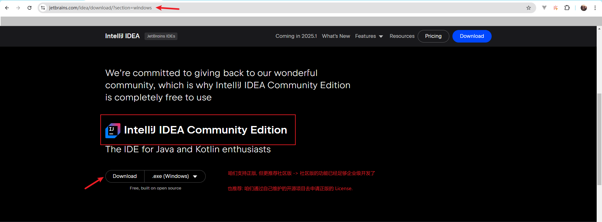

# `IDE`

## 1.编辑器

> 首推 `IDEA`

### 1.1.下载

- 支持: 正版
- 推荐: 社区版
- 鼓励: 通过自己长期维护的开源项目去申请-正版 `License`

```http
https://www.jetbrains.com/idea/download/?section=windows
// 根据咱自己的电脑选择对应平台的安装包
```



### 1.2.常用插件

- [Alibaba Java Coding Guidelines(XenoAmess TPM)](https://plugins.jetbrains.com/plugin/14109-alibaba-java-coding-guidelines-xenoamess-tpm-)
    - 编码规范
- [Atom Material Icons](https://plugins.jetbrains.com/plugin/10044-atom-material-icons)
    - `Icons`
        - 强烈推荐 - 可以通过肉眼直观的就能区分不同包
            - 比如:
                - `Controller`
                - `Service`
                - `Model`
                - …
- [CheckStyle-IDEA](https://plugins.jetbrains.com/plugin/1065-checkstyle-idea)
- [CamelCase](https://plugins.jetbrains.com/plugin/7160-camelcase)
    - 强烈推荐 - 驼峰转化
- [CMD Support](https://plugins.jetbrains.com/plugin/5834-cmd-support)
    - 可以直接运行脚本
- [CodeGlance Pro](https://plugins.jetbrains.com/plugin/18824-codeglance-pro)
    - 缩略图
- [GitToolBox](https://plugins.jetbrains.com/plugin/7499-gittoolbox)
    - `Git` 利器
- [GenerateAllSetter](https://plugins.jetbrains.com/plugin/9360-generateallsetter)
    - 自动生成 `Setter` 方法
- [GenerateSerialVersionUID](https://plugins.jetbrains.com/plugin/185-generateserialversionuid)
    - 生成序列化版本号
- [jclasslib](https://plugins.jetbrains.com/plugin/9248-jclasslib)
    - 查看字节码
- [Material Theme UI](https://plugins.jetbrains.com/plugin/8006-material-theme-ui)
    - 主题
- [Maven Dependency Helper](https://plugins.jetbrains.com/plugin/12041-maven-dependency-helper)
- [Maven Executor](https://plugins.jetbrains.com/plugin/11394-maven-executor)
    - …
    - Maven 相关的均可下载安装
- [Private Notes](https://plugins.jetbrains.com/plugin/17874-private-notes)
    - 源码注释利器
- [TONGYI Lingma](https://plugins.jetbrains.com/plugin/17809-tongyi-lingma--your-ai-coding-assistant-type-less-code-more-)
    - 任何一个 `AI` 助手均可
    - 代码提示: 强的 1 P
