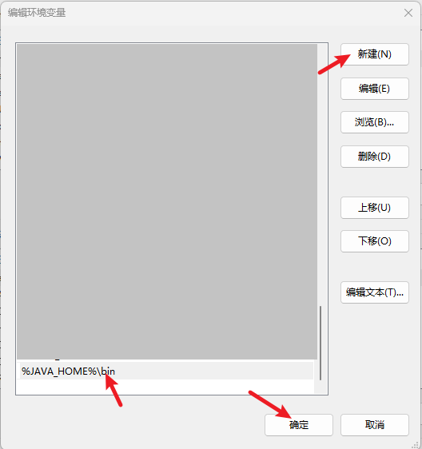

# `JDK` 安装

## 1.下载

```http
https://www.oracle.com/java/technologies/downloads/
```

## 2.平台

> 由于在实际开发过程中可能会使用多版本的 `JDK` 。故对于安装路径，我们可以采用有规律的命名方式:
>
> - `windows`
    >   - `D:\xxx\jdk\jdk8`
>   - `D:\xxx\jdk\jdk11`
>   - `D:\xxx\jdk\jdk17`
>   - …
> - `Linux`
    >   - `/xxx/jdk/jdk8`
>   - `/xxx/jdk/jdk11`
>   - `/xxx/jdk/jdk17`
>   - …
> - `MacOS`
    >   - `/Library/Java/JavaVirtualMatchines/jdk-xxx.jdk/Contents/Home`

### 2.1.`Windows`

```shell
# 1.配置环境变量
# JAVA_HOME=D:\xxx\jdk\jdk8
# |- $env.JAVA_HOME=D:\xxx\jdk\jdk8

# 早期版本
# ANT_HOME 不是必须的(仅仅是我本地有这个变量)
# CLASSPATH=.;%JAVA_HOME%\lib\dt.jar;%JAVA_HOME%\lib\tools.jar;%ANT_HOME%\lib;

# 2.加入到 PATH
# %JAVA_HOME%\bin

# ----------------------------------------------------------------

# 示例:
# 
# 注意: 部分 JDK 在安装时需要选择安装目录，安装好后还需要选择 JRE 安装目录。
# 假定: 我们将 JDK 8 安装在 D:\software\jdk\jdk8 下

# 对应: .../8/.../11/.../17/.../21/... 等任何版本
# 1.如果下载的是安装版 -> 安装时选择 `D:\software\jdk\jdk8` 目录即可
# |— 部分可能还需要选择 JRE 安装目录，比如: `D:\software\jdk\jre8`
# 2.如果下载的是解压即可用的版本 -> 直接解压到 `D:\software\jdk\jdk8` 目录即可

# 其他版本同理: 
# |- `D:\software\jdk\jdk8` | `D:\software\jdk\jdk11` | `D:\software\jdk\jdk17` | ...

# ----------------------------------------------------------------
# 实操:
# 配置 JAVA_HOME
# 1.添加环境变量 JAVA_HOME=D:\software\jdk\jdk8
# 添加 PATH -> %JAVA_HOME%\bin
# ---------------------------------------------------------------- JAVA_HOME
# 2.具体操作
# 1.Win + R 组合键
# 2.输入: sysdm.cpl
# 3.点击: 高级 - 左上方
# 4.点击: 环境变量(N)... - 右下方
# 5.点击: 新建(W)... - 右下方
# 6.输入:
# 6.1.变量名(N): JAVA_HOME
# 6.2.变量值(V): D:\software\jdk\jdk8 - 也可以点击左下方的 "浏览目录(D)..." 进行选择
# ----------------------------------------------------------------  PATH
# 配置 JAVA_HOME 加入 PATH
# 1.Win + R 组合键
# 2.输入: sysdm.cpl
# 3.点击: 高级 - 左上方
# 4.点击: 环境变量(N)... - 右下方
# 5.系统变量(S) - 下半部分
# 6.滚动滚轮 -> 找到 Path 变量
# 7.点击: 编辑(I)... - 右下(中间)
# 8.点击: 新建(N) - 右上
# 9.输入: %JAVA_HOME%\bin
# ---------------------------------------------------------------- 验证
# 验证
# $ java -version
# 看见如下类似的信息即可配置完成
# ----------------------------------------------------------------
➜ java -version
java version "17.0.5" 2022-10-18 LTS
Java(TM) SE Runtime Environment (build 17.0.5+9-LTS-191)
Java HotSpot(TM) 64-Bit Server VM (build 17.0.5+9-LTS-191, mixed mode, sharing)
```


#### `JAVA_HOME` 步骤

- 1.`Win + R` 组合键
- 2.输入: `sysdm.cpl`
    - 
- 3.点击: 高级 - 左上方
    - 
- 4.点击: 环境变量(N)... - 右下方
- 5.点击: 新建(W)... - 右下方
- 6.输入:
    - 6.1.变量名(N): `JAVA_HOME`
    - 6.2.变量值(V): `D:\software\jdk\jdk8`
    - 


#### `PATH` 步骤

- 1.`Win + R` 组合键
- 2.输入: `sysdm.cpl`
- 3.点击: 高级 - 左上方
- 4.点击: 环境变量(N)... - 右下方
- 5.系统变量(S) - 下半部分
- 6.滚动滚轮
    - 找到 Path 变量
        - 
    - 点击: 编辑(I)…
    - 添加 `JAVA_HOME` 环境变量到系统 `PATH`
        - 


#### 验证 `JAVA_HOME` 配置
- 


### 2.2.`Linux`

```shell
# 1.$ vi|vim /etc/profile
# 配置在其他文件下也可
# |- $ vi|vim ~/.bash_profile

JAVA_HOME=/usr/local/jdk/jdk8
JRE_HOME=$JAVA_HOME/jre
JNI_LIB=/opt/javajni/lib
CMAKE_HOME=/usr/local/cmake
PATH=$PATH:$JAVA_HOME/bin:$JRE_HOME/bin:$HOME/.cargo/bin:$JNI_LIB:$CMAKE_HOME/bin
# 早期版本
CLASSPATH=.:$JAVA_HOME/lib/dt.jar:$JAVA_HOME/lib/tools.jar:$JRE_HOME/lib

export JAVA_HOME JRE_HOME PATH CLASSPATH JNI_HOME
export LD_LIBRARY_PATH=$JNI_LIB:$LD_LIBRARY_PATH

# 我们只关心 JAVA_HOME 和 PATH 即可

# 2.source /etc/profile
```


### 2.3.`MacOS`

> 配置和 `Linux` 类似,也有快捷方式

```shell
# 1.确定 Java 安装位置
# |- $ /usr/libexec/java_home
# |- |- /Library/Java/JavaVirtualMachines/jdk-xxx.jdk/Contents/Home
# |- |- |- /Library/Java/JavaVirtualMachines/jdk-11.0.16.1.jdk/Contents/Home

# JAVA_HOME=/Library/Java/JavaVirtualMachines/jdk-11.0.16.1.jdk/Contents/Home

# 2.另一种方式
# 2.1.不指定版本
export JAVA_HOME=`/usr/libexec/java_home`
# 2.2.指定版本
export JAVA_HOME=`/usr/libexec/java_home -v 11`
```
