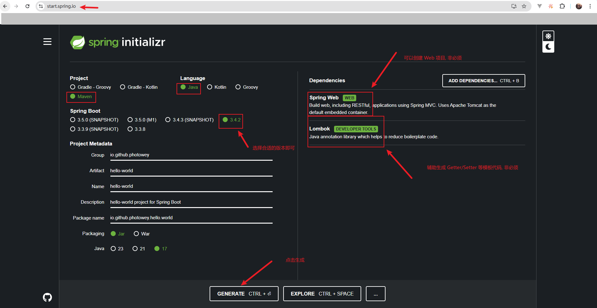

# `Java project`

## 1.`Maven` 工程

推荐: `Maven In Action` 书籍

> 首推采用 `Spring` 提供的在线工具生成

```http
https://start.spring.io
```




注意: 当没有 `JDK` 17+ 时, 将工程下载并解压后,咱们可以修改一下 `pom.xml` 中  `parent` 节点的版本号

```xml
<?xml version="1.0" encoding="UTF-8"?>
<project xmlns="http://maven.apache.org/POM/4.0.0" xmlns:xsi="http://www.w3.org/2001/XMLSchema-instance"
         xsi:schemaLocation="http://maven.apache.org/POM/4.0.0 https://maven.apache.org/xsd/maven-4.0.0.xsd">

    <modelVersion>4.0.0</modelVersion>

    <parent>
        <groupId>org.springframework.boot</groupId>
        <artifactId>spring-boot-starter-parent</artifactId>
        <!-- 修改此处的 parent 版本号 -->
        <version>2.7.5</version>
    </parent>

    <groupId>io.github.photowey</groupId>
    <artifactId>java-in-action</artifactId>
    <version>1.0.0-SNAPSHOT</version>

    <!-- @formatter:off -->
    <properties>
        <java.version>1.8</java.version>
        <project.build.sourceEncoding>UTF-8</project.build.sourceEncoding>

        <maven-compiler-plugin.version>3.8.1</maven-compiler-plugin.version>
        
        <!-- ... -->
    </properties>
    <!-- @formatter:on -->

    <!-- ... -->

</project>

```

### 1.1.`Maven` 大致结构

```shell
java-in-action # 工程名
|- src
  |- main
    |- java
      |- 自定义包名
      |- io.github.photowey.java.in.action
        |- App.java
        |- ...
    |- resources
      |- SPI 相关目录
      |- META-INF
      	|- ...
      |- 资源文件
  |- test
    |- java
      |- 自定义包名
        |- 测试相关类
    |- resources
      |- 测试相关资源文件
|- pom.xml
```


## 2.`Gradle` 工程

推荐: `Gradle In Action` 书籍

> TODO 咱先把 `Maven` 搞懂吧
